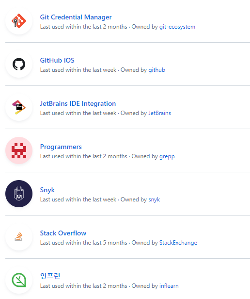

# 문제상황

## [403 Forbidden](https://developer.mozilla.org/ko/docs/Web/HTTP/Status/403)
> Authentication 이 완료되었지만 관련된 Authority 가 없을 경우 반환된다.
> 이 말은 해당 요청에 대한 권한이 없다는 것으로 해석된다.

## OAuth 의 취약점

다음 문구는 IntelliJ 에서 Push 가 실패되어 반환된 문구입니다.

```
the requested url returned error: 403
```

보통 신규 Organization 을 사용하려 할 때 발생됩니다.
HttpCode 상으로 이미 뜻을 알겠지만, 왜?! 발생했는 지를 알아볼 필요가 있습니다.
이에 대해 시나리오 순서로 설명해보겠습니다.

1. 인텔리제이에서 GitHub 의 권한을 OAuth 로 부여받는다.
2. 인텔리제이에서 GitHub 의 권한을 사용한다.
3. 새로운 Organization 에 참여한다.
4. 인텔리제이에서 GitHub 의 새로운 Organization 로 Push 한다.
5. 403 에러를 받고 실패한다.

여기서 문제의 원인은 OAuth 의 Grant 가 첫번째 이후로 자동으로 Reset 되지 않는다는 점 입니다.
새로운 대상이 생겨도 그것에 대한 Noti 를 주지않기에 사용자는 해당 Permission 을 별도로 관리해야됩니다.
이런 제한사항을 모르고 OAuth 로 연결된 인증으로 작업을 진행하면 403 이 반환되게 됩니다.
(이는 OAuth 가 아닌 Local Git 을 사용하게 되면 403 를 겪지 않는다는 뜻이기도 합니다.)

# 해결 방안

## 1. OAuth 를 재실행한다.

브라우저의 쿠키와 세션을 제거한 후 다음과 같이 재인증을 진행합니다.


아래 Organization access 는 `V` 표시로 전부 권환이 있는 상태입니다.  
만약 권한이 없다면 다음과 같이 OAuth 진행 중 신규대상의 권한을 묻습니다.


물론 이때 권한을 부여하지 않으면 다음과 같이 `X` 표시로 403 대상이 됩니다.

## 2. 개인 Settings 에서 설정합니다.


만약 `Grant` 표시가 생성되지 않는다면 다음 탭으로 개인 Setting 화면에 접속합니다.


그 후 `Integration > Applications > Authorized OAuth Apps` 순서대로 접근합니다.
(URI 상으로는 https://github.com/settings/applications 입니다.)



각 항목별로 클릭시 OAuth 와 같이 `Grant` 를 적용할 수 있습니다.
또는 우측 더보기 `...` 를 클락하여 권한 자체를 삭제하고 OAuth 인증시 `Grant` 단계를 재수행하게 합니다.

## 3. Organization Setting 에서 설정합니다.

만약 그럼에도 `X` 표시로 남았다면, Organization 의 Restrict 를 확인해야합니다.  
이는 각 Organization Setting 에 접속한 후 다음 탭을 선택합니다.


해당 탭은 Organization 별로 주어진 OAuth 제약입니다.


만약 위과 같이 Restrict 가 설정되어 있다면 개별 Restrict 를 수정하거나 전체를 삭제하여 허용할 수 있습니다.

---

# 결론

Authority 대상목록에 변화가 있을 경우,  
3rd 의 CallBack URL 로 Notification 을 전달하고  
3rd 는 새로운 Grant 작업을 사용자에게 요청해주면 UX 가 개선될 수 있지 않을까...?