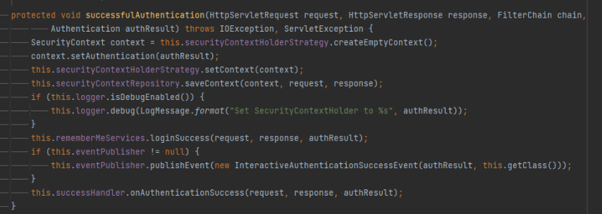

# GenericFilterBean

Spring 에서 사용되는 Filter 에 대해서 알아봅시다. SecurityFilterChain 의 Filter 는 Spring Container 에서 관리되기에 GenericFilterBean 추상클래스를 기반으로 작성됩니다.


# OncePerRequestFilter

대부분 Filter 는 요청당 일회의 처리만 필요합니다. 하지만 Servlet 은 Exception 처리를 Rediection 기반으로 수행하는데, 이때 Request 는 Filter 의 Chain 과정을 다시 한번 수행하게 됩니다. 이때 무의미한 반복행위는 자원낭비이기에 필요에 따라 제한해야합니다.

이에 대해 OncePerRequestFilter 는 Request 의 Attribute 에 해당 필터의 실행여부를 저장하고 구현체에서 #doFilterInternal 를 재정의하도록 분리하여 단일실행을 보장합니다.


물론 OncePerRequestFilter 를 상속받지 않아도 각 구현체들은 대부분 Request 의 Attribute 를 활용하여 단일 실행을 보장하고 있으니, 꼭 OncePerRequestFilter 를 상속받을 이유는 Readable Code 외에는 크게 없긴 합니다. (e.g. [AuthorizationFilter extends GenericFilterBean](https://docs.spring.io/spring-security/site/docs/current/api/org/springframework/security/web/access/intercept/AuthorizationFilter.html))

# AbstractAuthenticationProcessingFilter

다음은 Authentication 기반의 추상 Filter 클래스입니다. Spring Security 는 Delegator 패턴을 사용하기에 어디서든 적용하기 쉬운 구조입니다. 때문에 인증 Filter 를 위한 추상클래스는 유일하게 AbstractAuthenticationProcessingFilter 만 존재합니다. AbstractAuthenticationProcessingFilter 를 상속받아 제공된 구현체는 UsernamePasswordAuthenticationFilter 가 있습니다.

그럼 AbstractAuthenticationProcessingFilter 의 템플릿 메소드를 살펴보겠습니다. 크게 적용대상 확인 및 성공/실패에 대한 분류와 인증/인가 처리에 대한 부분이 존재합니다.


1.  #requiresAuthentication : 주입된 RequestMatcher 와 Request 적합여부 확인
2.  #attemptAuthentication : 요청에 대한 인증처리
3.  지정된 sessionStrategy 에 따른 인증정보 세션처리
4.  성공처리 전에 필터 체이닝 실행 ( 실제로 사용이 필요한 케이스를 모르겠음 )
5.  인증 결과처리
    1.  #successfulAuthentication : 성공 처리용 템플릿 메소드
    2.  #unsuccessfulAuthentication : 실패 처리용 템플릿 메소드

다음은 successfulAuthentication 의 기본구조 입니다. AbstractAuthenticationProcessingFilter 의 가장 큰 특징은 성공시 Filter Chaing 을 수행하지 않습니다. 이는 AbstractAuthenticationProcessingFilter 가 RequestMatcher 에 대한 의존성을 요구하는 것으로 보아 "/login" 과 같이 인증전용 엔드포인트를 위해서 작성되었다고 볼 수 있습니다. 물론 Jwt 와 같이 인증처리가 매번 수반되어야할 경우, successfulAuthentication 를 Override 하여 Chaing 을 추가해줄 수 있습니다.



1.  인증정보로 SecurityContext 생성
2.  SecurityContextHolder 에 SecurityContext 설정
3.  SecurityContextRepository 에 SecurityContext 저장
4.  설정에 따라 RememberMe 성공처리 (주로 In-Memory 를 사용한 Auto-Login 처리)
5.  성공에 대한 추가 Event 발생
6.  SuccessHanlder 로 정형화된 추가로직 수행

다음은 unsuccessfulAuthentication 의 기본구조 입니다.


1.  SecurityContextHolder 에 지정된 SecurityContext 제거
2.  RememberMe 실패처리
3.  FailureHanlder 로 정형화된 추가로직 수행

# JwtAuthenticationFilter

이제 위 두 추상클래스를 각각 활용한 JwtAuthenticationFilter 를 작성하고 비교해보겠습니다. JwtAuthenticationFilter 는 Bearer Token 에 대한 유효성을 인증하고 권한을 인가하는 필터입니다. 이를 구현하기 위한 제약사항은 다음과 같습니다.

-   Request Header 에서 Bearer Token 을 추출합니다.
-   Hashing 된 Bearer Token 을 복호화하여 Payload 정보를 추출합니다.
-   Payload 의 유효성을 검증합니다.
    -   Payload 의 만료여부를 확인합니다.
    -   Payload 에서 User 의 Unique Key 를 추출하여 User 의 유효성 및 권한을 확인합니다.
-   SecurityContext 에 해당 User 의 인증여부를 저장합니다.
    -   성공시 Authentication 을 저장합니다.
    -   실패시 Context 를 제거합니다. (제거된 Context 는 AnonymousAuthenticationFilter 에서 익명사용자를 위한 Empty Context 로 생성됩니다.)
-   Bearer Token 를 재생성 합니다.
-   Response Header 에 신규 Token 을 저장합니다.
-   Dispatcher Servlet 에 의한 MVC 처리를 진행합니다.
    -   HttpSecurity#authorizeHttpRequests 에서 지정된 Role 에 따른 권한설정은 AuthorizationFilter 에서 검증됩니다.
    -   SecurityContext 의 Authentication 는 SecurityContextHolder 로 활용할 수 있습니다. (e.g. 내 정보 조회하기)

## OncePerReqeustFilter 를 활용한 JwtAuthenticationFilter

```java
@RequiredArgsConstructor
public class JwtAuthenticationFilter extends OncePerRequestFilter {

    private final UserService userService;
    private final JwtUtils jwtUtils;

    @Override
    protected void doFilterInternal(HttpServletRequest request, HttpServletResponse response, FilterChain filterChain) throws ServletException, IOException {

        final String authorization = request.getHeader(HttpHeaders.AUTHORIZATION);
        if (authorization != null) {
            jwtUtils.extractBearerToken(authorization)
                    .ifPresent(jws -> saveAuthentication(jws, response));
        }

        filterChain.doFilter(request, response);
    }

    protected void saveAuthentication(Jws<Claims> jws, HttpServletResponse response) {

        final String userId = jws.getBody().getSubject();
        final UserDetails userDetails = userService.loadUserByUsername(userId);
        final String newToken = jwtUtils.createToken(userDetails);
        final UsernamePasswordAuthenticationToken authenticated
                = UsernamePasswordAuthenticationToken.authenticated(userDetails, newToken, new ArrayList<>());

        SecurityContextHolder.getContext().setAuthentication(authenticated);
        response.addHeader(JwtConstant.RESPONSE_HEADER_NAME, newToken);
    }
}
```

OncePerRuestFilter 는 자유도가 높습니다. 반대로 Authentication 에 대한 가이드가 존재하지 않습니다. 그렇기에 SecurityContext 에 Authentication 를 저장하기 위해 Spring Security 의 기본 Authentication 인 UsernamePasswordAuthenticationToken 를 활용할 수도 있습니다. UsernamePasswordAuthenticationToken 는 기본적인 User 인증처리를 위한 구성을 갖고 있고, 이를 재 인증할 경우 AuthenticationManager 의 DaoAuthenticationProvider 를 활용할 수 있다는 장점이 있습니다. 이는 기본으로 제공되는 BasicAuthenticationFilter 의 처리방식과 같습니다.

인터넷에 포스팅된 대부분의 예제들은 위와 같습니다. 하지만 해당 처리 방식의 의문은 SecurityContext 에 Authentication 를 지정해야하는 Spring Security 의존성이 존재하지만 Jwt 전용 AuthenticationProvider 와 Authentication(Token) 구성하지 않으므로써 Filter 가 UserService 와 JwtUtils 의 의존성을 가져가야한다는 점입니다. 초기 서버 구성시에는 작업이 빠르다는 장점이 있지만 반대로 직접 JwtAuthenticationFilter 의 로직을 확인하여야 검증된 다는 점에서 유지보수에 취약하다고 느껴집니다.

## AbstractAuthenticationProcessingFilter 를 활용한 JwtAuthenticationFilter

```java
public class JwtAuthenticationFilter extends AbstractAuthenticationProcessingFilter {

    public static final String ALREADY_DONE = "JwtAuthenticationFilter.DONE";
    public static final JwtAuthenticationConverter AUTHENTICATION_CONVERTER = new JwtAuthenticationConverter();

    public JwtAuthenticationFilter(AuthenticationManager authenticationManager) {
        super(new AntPathRequestMatcher("/we do not use this matcher"), authenticationManager);
    }

    @Override
    protected boolean requiresAuthentication(HttpServletRequest request, HttpServletResponse response) {

        return request.getAttribute(ALREADY_DONE) == null;
    }

    @Override
    public Authentication attemptAuthentication(HttpServletRequest request, HttpServletResponse response) throws AuthenticationException, IOException, ServletException {

        request.setAttribute(ALREADY_DONE, Boolean.TRUE);

        try {
            final JwtAuthenticationToken unauthenticated = AUTHENTICATION_CONVERTER.convert(request);
            return getAuthenticationManager().authenticate(unauthenticated);
        } catch (AuthenticationException ex) {
            request.removeAttribute(ALREADY_DONE);
            return JwtAuthenticationToken.failed();
        }
    }

    @Override
    protected void successfulAuthentication(HttpServletRequest request, HttpServletResponse response, FilterChain chain, Authentication authResult) throws IOException, ServletException {
        if (authResult.isAuthenticated()) {
            SecurityContextHolder.getContext().setAuthentication(authResult);
            response.addHeader(AuthConstant.JWT_RESPONSE_HEADER_NAME, ((JwtAuthenticationToken) authResult).getCredentials());
        }

        chain.doFilter(request, response);
    }
}
```

이번에는 Spring Security 의 Authentication 관련 구현체를 전부 작성해보았습니다. Filter 에는 기존의 UserService 와 JwtUtils 의 의존성은 사라지고 AuthenticationManager#authenticate 를 수행하기 위한 코드만 남게되어 가독성이 좋아진 걸 느낄수 있습니다.

하지만 Jwt 는 글로벌 적용이므로 AbstractAuthenticationProcessingFilter 의 RequestMatcher 의존성이 불필요해지기에 AbstractAuthenticationProcessingFilter 를 적용하기 보단 GenericFilterBean 상속하는 별도의 추상클래스를 작성하는 것이 좋다고 판단됩니다.

다음은 AuthenticationManager#authenticate 와 관련된 클래스들의 구현체입니다.

### JwtAuthenticationConverter

```java
public class JwtAuthenticationConverter implements AuthenticationConverter {

    @Override
    public JwtAuthenticationToken convert(HttpServletRequest request) {

        final String authorization = request.getHeader(HttpHeaders.AUTHORIZATION);

        if (authorization == null || !authorization.startsWith(AuthConstant.AUTHORIZATION_TYPE)) {
            throw new BadCredentialsException("No Bearer Token");
        }

        final String encodedJwt = authorization.substring(AuthConstant.AUTHORIZATION_TYPE.length());

        return JwtAuthenticationToken.unauthenticated(encodedJwt);
    }
}
```

UsernamePasswordAuthenticationFilter 는 Invalid 한 대상을 Dao 영역까지 처리하게 됩니다. 이는 불필요하게 RDBMS 의 세션을 할당받고 네트워크 비용으로 시간소요가 추가되는 방식이기에 BasicAuthenticationConverter 를 참고하여 Application 단에서 예외처리를 수행하도록 합니다.

### JwtAuthenticationToken

```java
public class JwtAuthenticationToken extends AbstractAuthenticationToken {

    private String userId;
    private final String headerValue;

    private JwtAuthenticationToken(String headerValue, Collection<? extends GrantedAuthority> authorities) {
        super(authorities);

        this.headerValue = headerValue;
    }

    private JwtAuthenticationToken(String userId, String headerValue, Collection<? extends GrantedAuthority> authorities) {
        this(headerValue, authorities);

        this.userId = userId;
    }

    public static JwtAuthenticationToken failed() {
        return new JwtAuthenticationToken(null, null);
    }

    public static JwtAuthenticationToken unauthenticated(String headerValue) {
        return new JwtAuthenticationToken(headerValue, null);
    }

    public static JwtAuthenticationToken authenticated(String userId, String headerValue, Collection<? extends GrantedAuthority> authorities) {
        JwtAuthenticationToken jwtAuthenticationToken = new JwtAuthenticationToken(userId, headerValue, authorities);
        jwtAuthenticationToken.setAuthenticated(true);
        return jwtAuthenticationToken;
    }

    @Override
    public String getCredentials() {
        return headerValue;
    }

    @Override
    public String getPrincipal() {
        return userId;
    }
}
```

AbtractAuthenticationToken 의 Principal 에 대해 Jwt 에서 추출할 수 있는 Persistence 의 유니크 키인 UserId 를 지정하여 활용합니다. 또한 AuthenticationConvert 에서 유효하지 않은 대상에 대해 Exception 처리 후 JwtAuthenticationToken 에서 실패한 failed() 된 토큰을 제공하여 AbstractAuthenticationProcessingFilter 의 템플릿을 준수하도록 구성했습니다.

### JwtAuthenticationProvider

```java
@Component
@RequiredArgsConstructor
public class JwtAuthenticationProvider implements AuthenticationProvider {

    private final JwtUtils jwtUtils;

    @Override
    public Authentication authenticate(Authentication authentication) throws AuthenticationException {

        final String headerValue = ((JwtAuthenticationToken) authentication).getCredentials();
        final Jws<Claims> claimsJws = jwtUtils.extractBearerToken(headerValue);
        final String userId = claimsJws.getBody().getSubject();
        final String newToken = jwtUtils.createToken(userId);

        return JwtAuthenticationToken.authenticated(userId, newToken, new ArrayList<GrantedAuthority>());
    }

    @Override
    public boolean supports(Class<?> authentication) {
        return JwtAuthenticationToken.class.isAssignableFrom(authentication);
    }
}
```

AuthenticationProvider 는 JwtUtils 의존성을 주입받게 됩니다. JwtUtils 의 로직을 Provider 에 직접 구성하지 않은 것은 JwtAuthorizationFilter 를 구성할 때에도 토큰발급 로직이 필요하기 때문에 JwtUtils 를 주입받아 동일한 처리방식을 유지하기 위함입니다. 여기서 UserService 를 추가한다면 현재 Persistence 에 저장된 데이터의 유효성까지 판단할 수 있습니다.

---

해당 작업의 결과로 Spring Security 는 Delegate 패턴으로 자유도가 높지만 Filter 에 대한 추상클래스를 별도로 작성하여 할 필요성이 느껴집니다. 특히 UsernamePasswordAuthenticationFilter 와 같이 Invalid Request 대상을 Persistence 접근까지 허용하는 것은 고려해봐야 할 것 같습니다.